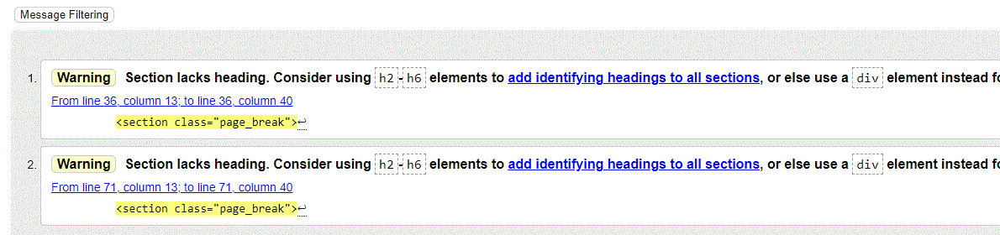

# Bespoke Peony Designs

Visit the live website [HERE](https://fluffybullet.github.io/peony_kisses/)

## Index
 - [Website Purpose](#aim-of-the-website)
 - [Research](#research)
 - [User Experience](#user-experience)
 - [Design](#design)
    - [layout](#layout)
        - [First Design](#first-design-mobile--small-screens)
        - [Second Design](#second-design-tablets)
        - [Third Design](#third-design-large-screens)
    - [Color Scheme](#color-scheme)
    - [font](#font)
- [Construction of website](#construction-of-website)
- [Features](#features)
- [Development of the project]
    - [Approach]
- [Testing](#testings-and-accessibility)
    - [Bugs found and Fixed](#bugs)
    - [Bugs yet to fixed]
    - [HTML Validation]
    - [CSS Validation]
    - [Links validation]
    - [Spell check]
    - [Accessibility rating]
- Deployment method
    - github pages
    - forking
    - making a clone
- [Roadmap](#roadmap)
    - [Social media integration]
    - [E-commerce possibility]
- [References](#references)
- [Acknowledgements](#acknowledgements)

--- 

## Aim of the website

Founder 'Gemma Seymour' has started Bespoke Peony Designs, starting as a biscuit maker for the unique events with a personal touch. Now combining with sourcing, crafting and baking skills - the portfolio now is aimed towards event planning and smaller catering requirements. 
Bespoke Peony Kisses displays the array of products, 

Link to live website:[HERE](https://fluffybullet.github.io/peony_kisses/)

---
## Research

Bespoke Peony Kisses is aimed at multiple markets offering a single or combined service. Each market focus on a specific layout/theme, with large volumes of animation. This website needs to offer a range of simplicity whilst showing the capability of customizing products offered.

Services are aimed towards a wide range of audiences who are looking to entertain a group or party of people during their hosting. Primarily targeted to the wedding scene, but not limiting or restricting parties for working environments, birthday parties, celebratory events.

My designs were used for the unique and simplistic views to the customer. All competitor websites were created in a block by block format with animation scrolling through an array of images. The views were effective, but rushed users to navigate away from the page.

## User Experience (UX)
### User Expectations

*First Time Users*

For a first time viewer, I would be following the flow of the website for information on the service and options of the company Bespoke Peony Kisses. First encounter is a a friendly welcome with a summary of the website, along with a navigation to confirm the feature/sections on the page.
As the consumer scrolls down the website page, they will be guided through a selection of images displaying previous creations to showcase their abilities. Followed shortly by events where the services have been utilized, with their own unique traits.

*Returning visitors*

Returning visitors visit the website with a link either via the navigation bar or the hyper-link in the welcome paragraph to "Contact Us" section, forwarding to the final section of the web-page - submitting the customers requirements, creating a simple and quick visit to the website.

## Design
### layout
for my layout, I chose a single page website displaying all information in a strategic method;
1. Introduction (getting to know the host)
2. Images/Gallery (Seeing the capability)
3. Prices (approximate guideline)
4. Contact form (Sending e-mails with their customisable enquiry)
5. Footer (to link over to social media's website.)

Following the above, I was able to create a template/wireframe for my website.
    
- #### First Design, Mobile & Small Screens
    - 
- #### Second Design (Tablets)
    - 
- #### Third Design (Large screens)
    - 
#### Color Scheme
As this website is created for my friend who has already created her profile with a dedicated facebook page. This resulted in a logo with specific colors created;

- ##### Background 
    - the background has a beige finish, which is matched using image color picker (Notes in references). Background color is #ebe53.
- ##### Font
    - Font on the above image is "Brown Sugar" but only available as a capitol letters only. To match a similar style, I browsed sites between fonts.google, dafont and various other sites. Finding Playfair display from google fonts. 

- #### Responsive behaviour
    - In the wireframes created, I selected layouts that include sections side by side with tables of information, event styles. [edit] Further along the project, I reviewed the opening page and discussed with the potential user of the website, changing the layout of welcome section, which includes logo as a center image with welcome text on the right.
    - Font size is to be adjusted to the display equipment, this is created by using elements with a rem selector for font size, reactive css then changes the default font size when expanding to a larger screen.
    - Desktop version changed to navbar being linked to the top of the page, pushing the companies logo to be adjacent to the welcome text.
    - For interaction with the user of the webiste, I included animations to respond to clicks or locations of mouses. 
        + Page-breaker icons/images, to hide when hovered over or clicked on, then re-appearing when opposite reaction is actioned.
        + Highlighting of table rows in pricing guide, for easier viewing of prices
        + Changing color bottons in contact form to confirm ation has been completed on request.

## Construction of website
This website has been using with construction of HTML and CSS, core languages trained by Code Institute for my first project.

## Features

## Progression
mobile first image
### mid-stage
Mid-stage in my project, I exported my HTML code to W3 Validator for HTML. The website had found some codes with an error, mostly div tags without a closing tag and break lines coded as self-closing, but not required. On review of the below image, I corrected end with removal of end tags and closure tags.

Further checks at a later stage shown a reduced quantity of errors and further corrections to be made.

The above errors were fixed by changing the page break sections with div's, as these are images to transition from page 1 to 2 etc. Not requiring a header.

During the above checks, no errors were found on css w3 (jigsaw) validator.

## Testings and Accessibility
- ### bugs 
    - [x] form layout 
    - [x] Image Overlay 
        - In the introduction of image gallery, I created an animation overlay when pressing/hovering over an image. On my first attempt, I found the overlay covered the top segment of the website. 
 
This was fixed by adding additional container with relative position, as the primary div's were position:absolute. 
    - [x] Icons not displaying
        - 
        - This was fixed by including the "awesome font" href in the head of HTML. - found in references.
     - [x] Font on overlay of pictures to adjust to size.
        - adjusted to 50 vertical on CSS, with font sizings adjusting to the display equipment
    - [x] on reactive media to large screens +1Kpx, contact form overlaps page breaker icons. Squashed upwards ?
        - welcome division had fixed height which squashed on smaller sizes, removal of fixed height correct this.
    - [x] email logo to be shown above contact us section for page breaker.
        - created as a p element with styling, confirming icons rather than images or text.  

- [Bugs to fixed]
    - [] Contact us events and idea's text area to display a multiple lines rather than single line.
   
- [Format]
- [HTML Validation]
    * During the course, this website and it's code has been tested using w3 validator and jigsaw w3 validator. Some errors have been found and logged within the testing stage, then corrected at a later point.
    On completeion of the project, final checks with both w3 validator and jigsaw w3 validator have confirmed no errors found within the code. 
- [CSS Validation]
    * During the course, this website and it's code has been tested using w3 validator and jigsaw w3 validator. Some errors have been found and logged within the testing stage, then corrected at a later point.
    On completeion of the project, final checks with both w3 validator and jigsaw w3 validator have confirmed no errors found within the code. 
- [Links validation]
- [Spell check]
- [Accessibility rating]

## Roadmap

The aim of the websites first creation is static information to show a range of products available to buy. Features to be added at a later stage is:
- live blogs of social media post, Facebook and Twitter
- E-Commerce site, for a selection of generic made biscuits/cakes
- Upload of images to send via form for special products

## Deployment

## Credits

### References
websites used

[Balsamiq software](https://balsamiq.com/) - www.balsamiq.com
>*Software to draft designs and layouts of the website.*

[Image Color Picker](https://imagecolorpicker.com/en) - www.imagecolorpicker.com
>*Used to identify the color of the background within the logo image provided. This is used to accurately quote the Hex reference for background color.*

[Pexels](https://www.pexels.com/) - www.pexels.com
>*Stock images used for gallery.*

[w3 Schools online](https://w3schools.com) - www.w3schools.com
>*Variety of HTML and CSS Codes, including image hover effect.*

[Awesomefont](https://awesomefont.com) - www.awesomefont.com
>*Customized icons for events tab, relevant to specific host.*

[W3 Validator](https:validator.w3.org) - www.validator.w3.org
>*Checking of HTML code for errors or incorrect formats.*

[Google Fonts](https://fonts.google.com) - www.fonts.google.com
>*Fonts used on website - Playfair Dsiplay"

[HTML & CSS book](#https://www.amazon.co.uk/s?k=jon+duckett+html+and+css&sprefix=jon+duckett%2Caps%2C73&ref=nb_sb_ss_ts-doa-p_4_11) - Book borrowed from Jason Reynolds.
>*Hints, tips and presentation of html and css used throughout the codes*

images used
icons

### Acknowledgements
Contacts discussed the project with
1. Huge thank you to my brother, Jason Reynolds of Cappfinity. Guiding me with my questions and prompting me rather than supplying answers.
2. Mentor Marcel Mulders, conversations with what examples to look for, what may be helpful and objectives to be mindful of.
3. Class mate - Anna Gabain, through long conversations covering some syntax logics and their meanings, whilst showing on my screen allowed me to develop my project.
4. Class mate - Jamie King, presenting projects to each other and comparing notes with each other.
5. Class mate - Fran Boyle, possitive attitude and showing another perspective to approach the coding methodology during this course.
6. Class mate - Gerard Kelly, conversations on presentation of files and path directories. Also preperation of information and display (front end).